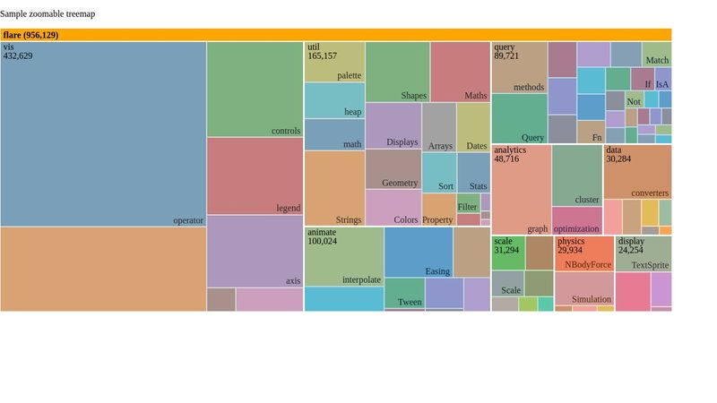
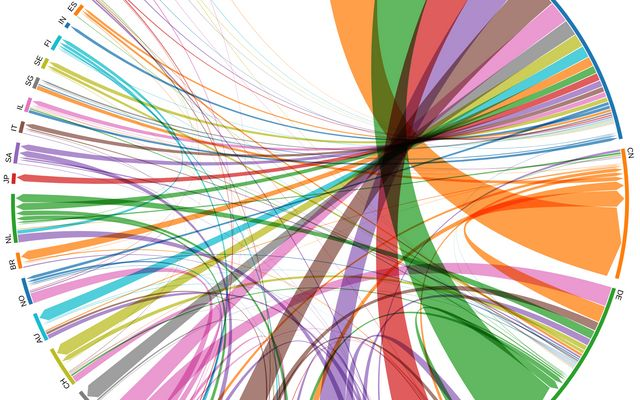
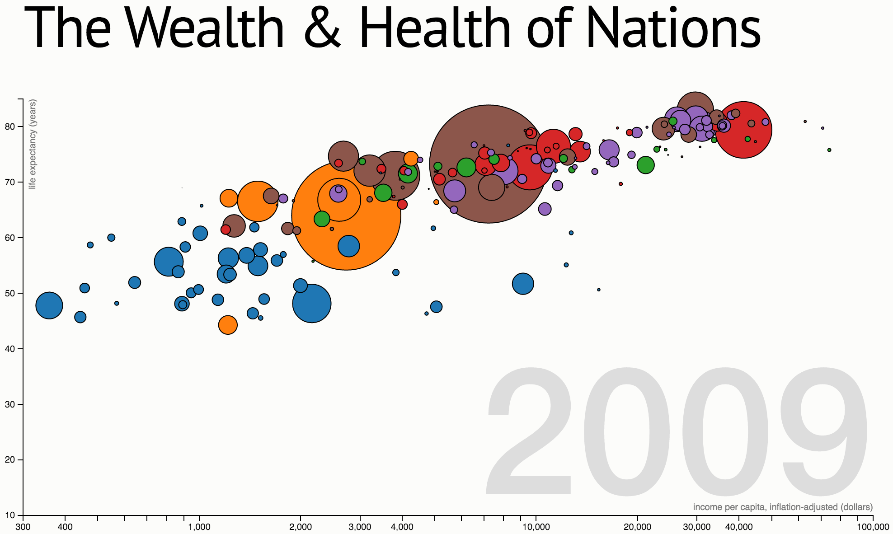
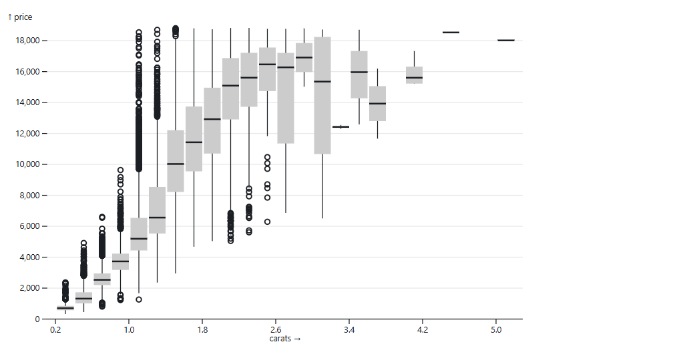
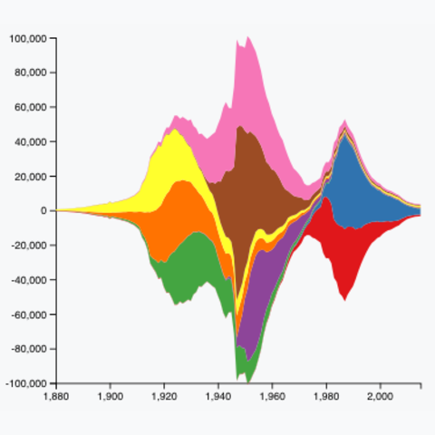
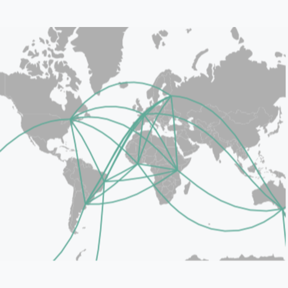

# The Football Transfer Market

**STATS 401 Final Project Proposal**

**Group members:** Zihan Ma and Muhammad Anas Tahir (Team Leader)

## 1. Topic, Goals, and Questions

European football clubs spend enormous sums on player transfers, yet they play very different roles in the market. Some clubs repeatedly buy established players, while others develop talent and sell it on. This project examines how money moves through the market, how spending relates to performance, and whether pre-signing rumors are associated with the financial outcome of a deal. The aim is to move past record-breaking headlines and show the structure underneath.

Our goals are to reveal spending trends, map buying and selling networks, compare investment against performance, and link pre-transfer rumors to completed deals. The audience is football fans, analysts, journalists, and readers interested in sports economics. The dashboard opens with an overview, then filters and drills into leagues, clubs, and players.

**Research question:** How does money move through the European football transfer market, and what factors shape the financial outcomes of transfers?

- **Market structure:** How have transfer spending and cross-league flows changed over time, and which clubs and leagues act as buyers, sellers, hubs, or feeders?
- **Spending and performance:** To what extent is club spending associated with later sporting performance, and which clubs over- or under-perform relative to their spending?
- **Rumors and outcomes:** Before a signing, how are rumor intensity, tone, and agent-attributed reports associated with the final fee and the change in a player's market value?

## 2. Datasets

Our primary source is the CC0-licensed [Transfermarkt dataset repository](https://github.com/dcaribou/transfermarkt-datasets), downloaded as CSV files or a DuckDB database. It holds roughly 87,000 transfers, 500,000 historical valuations, 37,000 player profiles, 1.8 million appearances, and club, competition, and game records. Key attributes include fees, dates, origin and destination clubs, leagues, age, position, market value, and match performance. We will standardize currencies and seasons, separate loans, handle missing fees, aggregate club and league flows, compute net spending, and join tables through shared identifiers. The core sample covers the Premier League, La Liga, Bundesliga, Serie A, and Ligue 1.

Our second dataset is built by web scraping and public RSS feeds, initially from [The Guardian](https://www.theguardian.com/football/transfer-window) and [BBC Sport](https://support.bbc.co.uk/platform/feeds/SportFeeds.htm). We expect 1,000 to 5,000 recent articles with date, outlet, headline, URL, player, clubs, reported terms, and rumor language. Collection follows robots.txt, source terms, and rate limits. Normalized names, clubs, and dates link articles to completed transfers, and an "agent-originated" flag requires explicit attribution to an agent. The primary outcome is the change in a player's market value, which the repository records over time; wages are used only as an optional overlay where consistent data exist.

Three further sources, suggested by working football analysts, support and cross-check these. [StatsBomb open data](https://github.com/statsbomb/open-data) adds detailed match events to enrich performance measures. [Capology](https://www.capology.com/) provides salary and contract estimates for the optional wage overlay. [Kaggle](https://www.kaggle.com/datasets) football-finance datasets help sanity-check fees and valuations. Analysts confirmed Transfermarkt as a dependable transfer source, which is why it anchors the project.

## 3. Analysis and Visualization Methods

Python with requests, BeautifulSoup or feedparser, pandas, and DuckDB will handle acquisition, cleaning, matching, and aggregation, while D3.js, HTML, and CSS build the dashboard. Measures include total and net spending, fee-to-value ratios, post-window performance, rumor and source counts, time from first rumor to signing, and rumor tone or certainty. Because valuable players attract more coverage, results are presented as associations rather than causal effects.

The six coordinated views support trend identification, network exploration, comparison, relationship discovery, filtering, and outlier detection. Shared filters cover season, league, club, position, and transfer type, and linked highlighting connects views so a selection in one updates the others.

## 4. Visualization Sketches or References

### 1. Zoomable animated treemap — transfer-market composition over time

Reference: [observablehq.com/@d3/zoomable-treemap](https://observablehq.com/@d3/zoomable-treemap)

Each rectangle is a league, its area showing total spending and its color net buying or selling. A season slider reveals shifts in market share, and clicking a league expands to the clubs within it.

### 2. Directed chord diagram — transfer-fee flows between leagues

Reference: [observablehq.com/@d3/directed-chord-diagram/2](https://observablehq.com/@d3/directed-chord-diagram/2)

Each segment is a league and directed ribbons show fee flows from buying to selling leagues, with ribbon width encoding total fees or transfer counts, exposing major buyers, sellers, and feeder relationships.

### 3. Animated bubble scatterplot — club spending and later performance

Reference: [observablehq.com/@mbostock/the-wealth-health-of-nations](https://observablehq.com/@mbostock/the-wealth-health-of-nations)

Each bubble is a club, with spending on the x-axis and later performance on the y-axis. Size encodes market value and color encodes league, and a season control animates how clubs move, highlighting over- and under-performers.

### 4. Rumor-outcome box plot — outcomes across rumor-intensity groups

Reference: [observablehq.com/@d3/box-plot/2](https://observablehq.com/@d3/box-plot/2)

Box plots compare the distribution of fee premiums and market-value changes across low, medium, and high rumor-intensity groups, testing whether heavier pre-signing coverage aligns with larger financial swings.

### 5. Rumor coverage streamgraph — rumor volume and tone before a signing

Reference: [D3 Graph Gallery — Streamgraph](https://d3-graph-gallery.com/streamgraph.html) (see also [D3 official streamgraph](https://observablehq.com/@d3/streamgraph/2))

A stacked, flowing area chart tracks weekly article volume in the run-up to a deal, split by tone (optimistic, neutral, doubtful), showing how hype builds and shifts as the signing approaches.

### 6. Geographic flow (connection) map — transfer-fee flows between countries

Reference: [D3 Graph Gallery — Connection map](https://d3-graph-gallery.com/connectionmap.html) (see also [Bostock, Country Topology](https://observablehq.com/@mbostock/country-topology))

Countries are joined by arcs that trace transfer-fee flows between them, with arc width or color encoding the total fees, adding a spatial layer that reveals which nations import talent and which supply it.

## 5. Group Roles and Responsibilities

### Zihan Ma

- Structured GitHub data pipeline and implement the spending-trend and Sankey views.
- Builds the structured Transfermarkt pipeline: cleaning, currency and season standardization, table joins, and club and league aggregation, and implements the zoomable treemap and the directed chord diagram.

### Muhammad Anas Tahir

- Builds the scraping pipeline and constructs the rumor variables (intensity, tone, agent attribution) and the record linkage to completed transfers.
- Implements the rumor coverage streamgraph and the geographic flow map.

### Shared

Both members build the spending-performance scatterplot and the rumor-outcome box plot, and share the dashboard integration, shared filters and linked highlighting, testing, documentation, and presentation. Each reviews the other's data pipeline so both understand the full project.

## 6. Interim Presentation Deliverables

By the interim check-in we will present cleaned Transfermarkt tables, a pilot scrape with summary statistics, our record-linkage rules, and reviewed article-to-transfer matches. We will show refined questions, all six visualization references, and at least three working static D3 prototypes: the treemap, the spending-performance scatterplot, and one rumor view. We will also share an interaction and animation plan for each view and an evaluation plan covering what we will assess, how, and what feedback we collect.

## 7. Timeline and Milestones

| Week | Milestone | Tasks | Responsible | Expected output |
|------|-----------|-------|-------------|-----------------|
| 2 | Proposal and setup | Finalize questions, league scope, and sources; set up the GitHub repository, data schema, and coding conventions. | Both | Approved proposal; initialized repository |
| 3 | Data acquisition and cleaning | Clean and join Transfermarkt tables; build and run the pilot news scraper; define article-to-transfer linkage rules. | Zihan (repo data); Anas (scraper, linkage) | Analysis-ready tables; pilot rumor sample with matching report |
| 4 | Exploration and design | Run EDA on fees, flows, and rumor variables; finalize encodings and interactions for all six views; draft dashboard layout. | Both | EDA summary; design spec and wireframes |
| 5 | Interim prototype | Implement three static views (treemap, spending-performance scatter, one rumor view); draft interaction and evaluation plans. | Zihan (treemap, scatter); Anas (rumor view) | Working interim demo on GitHub Pages; interim write-up |
| 6 | Implementation and interaction | Build the remaining views; add shared filters, linked highlighting, tooltips, and animation; integrate one dashboard. | Zihan (treemap, chord); Anas (streamgraph, map); Both (scatter, box plot) | Integrated interactive dashboard |
| 7 | Refinement and delivery | Run a usability check and revise; add annotations and narrative; document limitations; deploy; prepare poster and talk. | Both | Final dashboard, report, poster, and rehearsed presentation |
